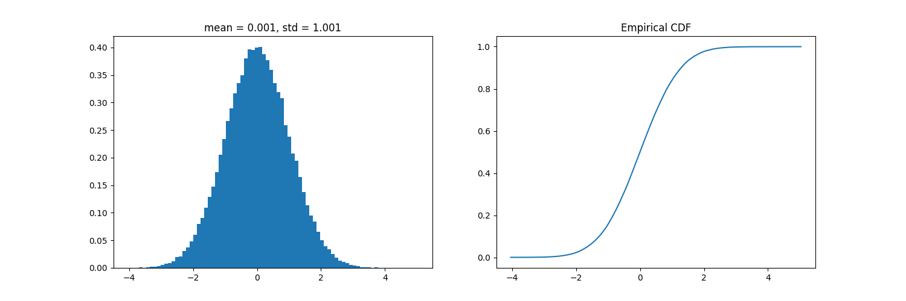

This is a small personal project where I try to build a build an executable program that generates random numbers from various distributions in order to learn C. 

The RNG itself I took off this [book](https://numerical.recipes/).

For now I have only implemented normal distribution using the [ziggurat method](https://www.doornik.com/research/ziggurat.pdf). 

The internal state of the RNG is saved to `$HOME/.ran_c/state.bin` if the file does not exist the rng is initialised from `--seed` which is `1337` by default but can be set to whatever `uint64`.

Example usage: 
```bash
$ crng --dist normal --seed 1337
0.0471260969
```

You can also specify the number of samples to generate via the flag `-n`, and save the result to a file with the flag `-f`. 

I also added a python script for convenience that plots the distribution all you need to do is feed it a file with the samples. Also you would need `matplotlib` `numpy` and `pandas`.

Example usage:
```bash 
$ crng --dist normal --seed 1337 -n 100000 -f samples/samples.txt
$ python scripts/distribution.py -f sample/samples.txt

```


NOTE: For now samples are saved as txt which is not ideal but I will change that soon.
